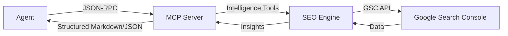

The `search-console-mcp` server acts as a middle layer between your AI agent and the Google Search Console APIs.

## Logic Layers

### 1. The Client (e.g., Claude)
The agent initiates a request. It doesn't need to know the GSC API schema; it only needs to know the tools exposed by the MCP.

### 2. The MCP Server (Middleware)
This is where the magic happens.
*   **Tool Registration:** Defines the JSON schema for tools like `analytics_time_series`.
*   **Request Handlers:** Receives inputs, validates them with **Zod**, and routes them to the correct tool logic.
*   **SEO Intelligence Engine:** Performs the heavy lifting—calculating rolling averages, standard deviations, and trend analysis.

### 3. Google API Layer
The server uses authorized service accounts to communicate with:
*   **Search Console API:** For performance data and site management.
*   **PageSpeed Insights API:** For performance and Lighthouse data.
*   **URL Inspection API:** For individual page indexing status.

## Data Flow

## Security Design

*   **Local Execution:** The server runs on your machine (or your own cloud instance). Your data never touches our servers.
*   **Read-Only Defaults:** While we support management tools (adding sites), most analysis tools are strictly read-only by design.
*   **Deterministic Output:** We prefer returning structured data or markdown tables that the agent can read and process reliably.
