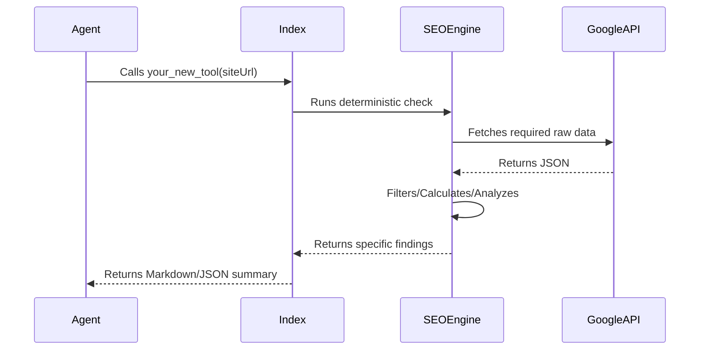

We welcome contributions of new SEO intelligence tools. To maintain the quality of the project, please follow these guidelines.

## Where to add logic

1.  **Core Logic:** Add your calculation logic to `src/tools/analytics.ts` or a new file in `src/tools/`.
2.  **Tool Registration:** Register the MCP tool in `src/index.ts`.
3.  **Schemas:** Use **Zod** to define strict input schemas for your tool.

## Guidelines for Intelligence Tools

If you are adding an "Intelligence" tool (one that performs analysis rather than just returning data):

*   **Be Deterministic:** If your tool uses a threshold (like "min impressions"), make it a user-controllable parameter.
*   **Return Proof:** Include the raw metrics that led to the conclusion in the output.
*   **Use Standard Methodologies:** Reference established SEO practices (e.g., Strike Distance is commonly defined as positions 11-20).
*   **Documentation:** Add a dedicated page for your tool in the `docs/tools/` directory.

## Example Tool Workflow

